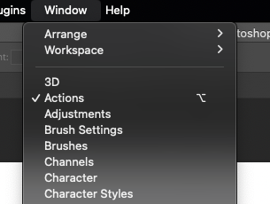
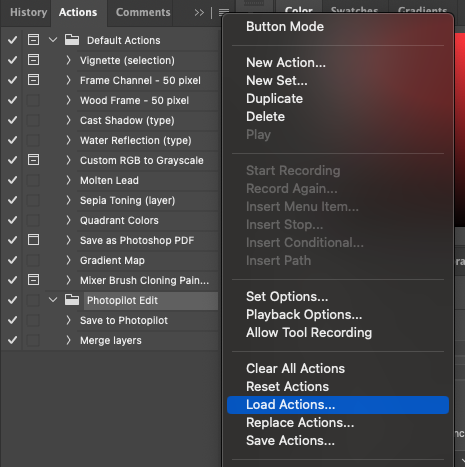

# Edit photo's using photoshop directly in interface

# Dutch
1. [Download photopilot-edit-action.atn](https://cdn.photopilot.ai/photopilot-edit-action-2.atn)
2. Open Photoshop
3. Open Venster > Handelingen
   

5. Klik op "Laad handeling"
   

7. Selecteer de gedownloade actie

# English
1. [Download photopilot-edit-action.atn](https://cdn.photopilot.ai/photopilot-edit-action-2.atn)
2. Open Photoshop
3. Open Window > Actions
   

5. Click on "Load actions"
   

7. Select downloaded action
