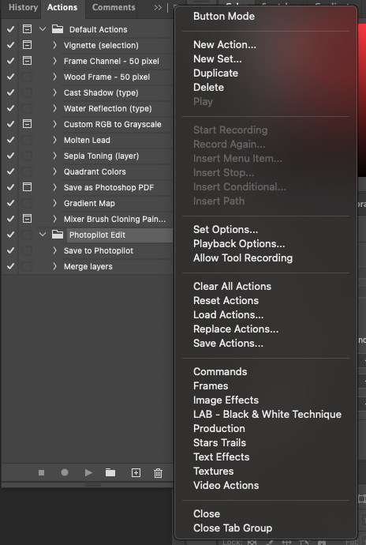

# Edit foto's in photoshop

## Download photoshop actions
1. [Download hier](https://cdn.photopilot.ai/photopilot-edit-action)
2. Open photoshop
3. Open photoshop acties

5. Klik op "Load actions (Laad acties)"

7. Selecteer de gedownloade actie
8. De photoshop actie is nu klaar voor gebruik
